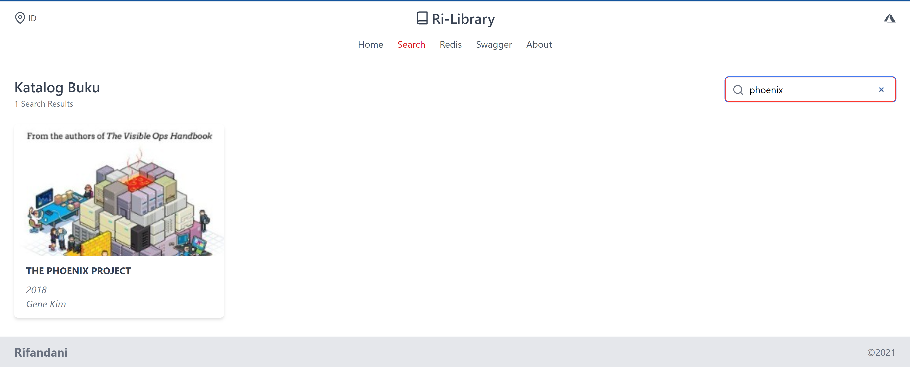
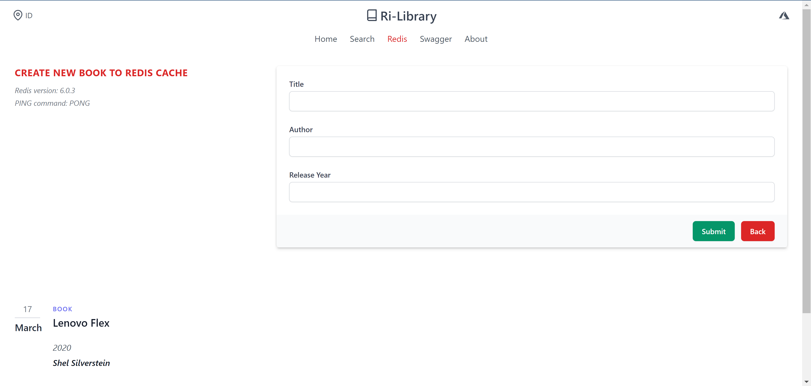
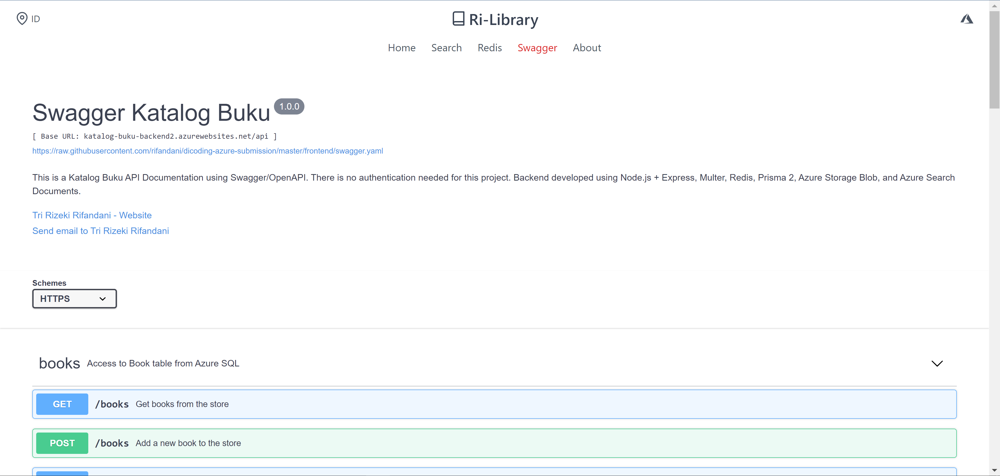

# 📃 Description

Projek ini adalah submission dari Dicoding untuk kelas Menjadi Azure Cloud Developer. Kelas ini memiliki 2 submission yang harus diselesaikan untuk mendapatkan sertifikat.

Submission 1 dengan kriteria fitur:

- Menampilkan daftar buku dari database,
- Menambahkan data buku ke database dan storage,
- Mengubah data buku dari database,
- Menghapus data buku dari database,
- Menambahkan review pada buku yang disimpan di database.

Submission 2 dengan kriteria fitur:

- Fitur pencarian buku,
- Menerapkan caching,
- Menyediakan API Gateways bagi pengguna atau developer lain yang ingin mengakses API.

_NOTE: Untuk Semua Pricing tier di Azure CDN tidak dapat menggunakan Azure Student Account._

> Submission 1 diharuskan menggunakan layanan komputasi dan penyimapanan dari Microsoft Azure, seperti Azure SQL Databases, Azure App Service, Azure Blob Storage. Sedangkan pada Submission 2 diharuskan menggunakan Azure Cognitive Search, dan Azure API Management.

## 👨🏻‍💻 Tech Stack

Frontend menggunakan Next.js, Typescript, SWR + Axios, dan TailwindCSS.
Frontend static di deploy ke [Azure Static Web App](https://thankful-wave-086fca500.azurestaticapps.net/).
Backend menggunakan Express.js, Typescript, dan Prisma.
Backend di deploy ke Azure App Service.
Azure API Management [Developer Portal](https://katalog-buku-api.developer.azure-api.net/)

## 📷 Screenshots

  

  

  

  

  

