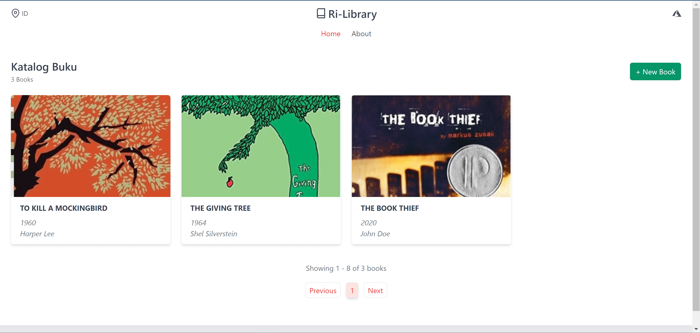
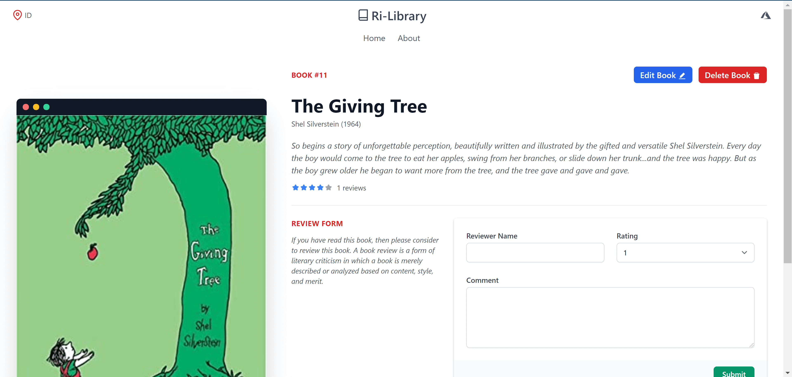

# 📃 Project Description

Projek ini adalah submission dari Dicoding untuk kelas Menjadi Azure Cloud Developer. Terdapat 2 submission di dalam kelas ini. Submission 1 dengan kriteria fitur:

- Menampilkan daftar buku dari database,
- Menambahkan data buku ke database dan storage,
- Mengubah data buku dari database,
- Menghapus data buku dari database,
- Menambahkan review pada buku yang disimpan di database.

> Projek ini diharuskan menggunakan layanan komputasi dan penyimapanan dari Microsoft Azure, seperti Azure SQL Databases, Azure App Service, Azure Blob Storage

## 👨🏻‍💻 Tech Stack

Frontend menggunakan Next.js, Typescript, SWR + Axios, dan TailwindCSS.
Frontend static di deploy ke Azure App Service.
Backend menggunakan Express.js, Typescript, dan Prisma.
Backend di deploy ke Heroku.

## 📷 Screenshots

  

  

